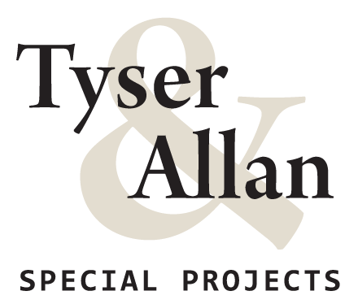
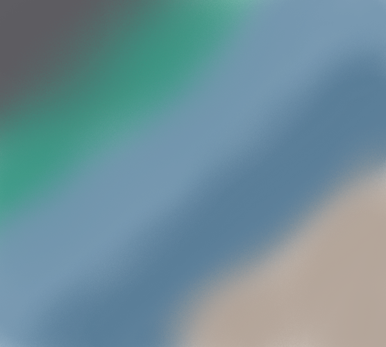

# MileStone Project Four- Tyser&Allan "Special Projects"

A project designed for Tyser&Allan who specialise in special projects in regards to landscaping and event
draping. A couple of my good friends have recently joined forces and set up a business and I will now be 
making their website for them. The idea is to show off the amazing work they do and make a fully functioning
website that allows users to get in touch for quotes and/or buy merchandise that they are selling. 

You can get to my live site through the following link [INSERT LINK HERE MEGHAN]

# Table of Contents

**[UX](#UX)** 
**[Features](#Features)** 
**[Technologies Used](#Technologies-used)** 
**[Testing](#Testing)** 
**[Deployment](#Deployment)** 
**[Credits](#Credits)** 
**[Acknowledgement](#Acknowledgement)** 

## UX
 
### Goals
## Visitor Goals
The goals for a visitor to the site are 
* To understand what work the business does
* To get informed information about the company
* To get quotes and/or buy merchandise

## Business Goals
The goals for the business are
* To showcase their business
* To gain a customer base
* To have a professional clean and fully functional website

### User Stories
1. As a website visitor I want to be able to navigate through the site and see what they offer
2. As a website visitor I want a clear defined path
3. As a website visitor I want to be able to buy merchandise sold
4. As a website visitor I want to be able to request a quote
5. As a website visitor I want to know what the site purpose is
6. As a business owner I want my work displayed correctly and professionaly
7. As a business owner I want to gain more customers
8. As a business owner I want  to show different aspects of my business
9. As a business owner I want to see a clear path for visitors
10. As a business owner I want my website to portray and showcase my business

### Wireframes

### Color scheme

I used a calming neutral set of colors as seen in the image. These colors are inline with
the brand and allow ease of use looking at the site. The color codes are as follows.
#7395AE
#5D5C61
#b1a296

I moved away from the green color from this picture as it wasn't very pleasing to the eye.

### Typogrophy
Robotto, it works perfectly for my project as I didn't need anything fancy.
## Features
* Home page- A nice and simple page explaing a little about the company and how it works.
* Draping- Explaing the different kind of drapes that we do
* Landscaping- Explaing different kinds of lnadscaping jobs that we do
* Merchandise- Allows the customer to add items to tehir basket and purchase them.
* Contact Form- Allow customers to email us specifications for a quote.
### 

## Features Left to Implement
* I would like to implement a Trust Pilot, so customers can leave realtime reviews.
###

## Technologies Used
Below is a list of all technologies used in order to achieve the end goal.

#### Languages
* HTML -A standard markup language used for the content of my webpage
* CSS - A style sheet language used for the design of the web page
* JavaScript - A text based programming language used to make a web page
interactive, in conjunction with HTML and CSS as a base for formatting.
* Python- for functionality of my site
* Django- Full Stack FrameWork. 

#### Frameworks
* Bootstrap- Used to format and style my site.
* Flask- Micro framework for python
* MongoDB- to store my database
* SQlite- as my database locally
* Postgress- as my database deployed.

#### Libraries
* Google Fonts [https://fonts.google.com/]
* Font Awesome(Bootstrap Library) [https://www.bootstrapcdn.com/fontawesome/]
* Bootstrap Jquery [https://getbootstrap.com/docs/3.3/javascript/]
* W3 Schools [https://www.w3schools.com/] a great base to get refresher materialswhen help was needed.
* Youtube [https://www.youtube.com/] for some tutorials when things where tough
* 

##### GitPod/GitHub
* GitPod was the IDE I used for my project

##### Heroku
* Heroku was used to deploy my project

## Testing 

## Deployment

## Credits
* Oliver Tyser and Mark Allan for allowing me to use their images and company to make a website.
* Jak of all trades for constant support and pressure to get this done.
* Code Institute!
* My mentor Maranatha 